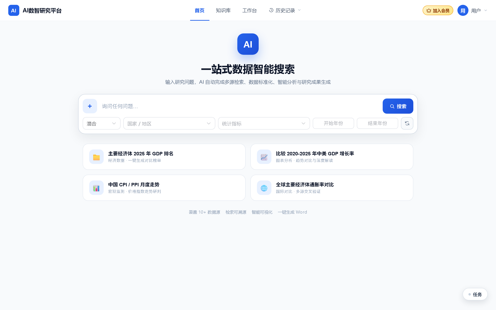
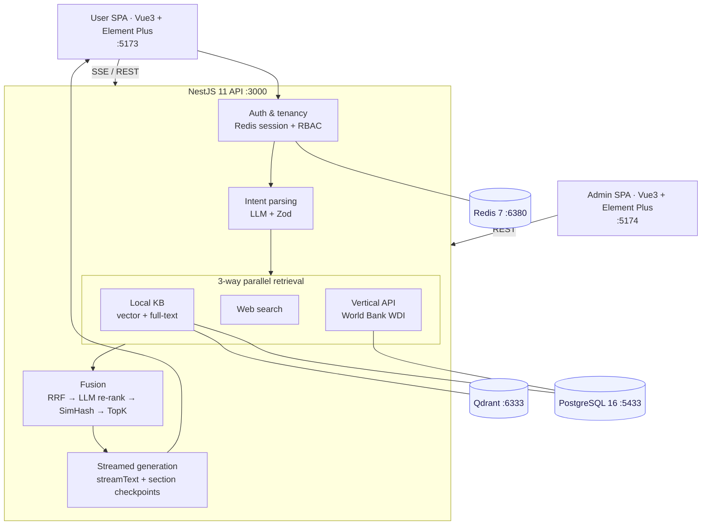

<div align="center">



# AI Digital Research Platform

**One-stop intelligent data search · Knowledge-base RAG · Analytics workbench · AI research report generation**

A multi-tenant SaaS platform for industry research and decision support. Ask one question;
the AI handles multi-source retrieval, data normalization, analysis and report generation —
fully streamed, with every citation traceable to its source.

[中文说明](./README.md) · [Quick Start](#-quick-start) · [Architecture](#-architecture)


</div>

> This is the condensed English version. The full documentation set (`docs/`) is written in Chinese.

## 📌 The idea

Analysts usually bounce between search engines, statistical databases, spreadsheets, vector stores and
a word processor. This platform collapses that chain into a single question:

```
Question → intent parsing (structured filters) → 3-way parallel retrieval → RRF fusion + LLM re-ranking
        → streamed report generation → citation badges ↔ source cards → Word / PPT / PDF export
```

The guiding principle is **Pipeline-First**: data acquisition, cleaning and fusion are *deterministic
engineering* (unit-testable, quality-controlled). The agent only reasons over a clean context —
it never does the data grunt work.

## ✨ Capabilities

**AI search (the core of the platform)**

- LLM intent parsing emits `{intent, countries[], indicators[], yearFrom, yearTo, routeHints}` against a
  Zod schema, streamed back via an SSE `cond_fill` event to pre-fill the filter bar
- Three parallel routes behind one `SearchConnector` interface — local knowledge base, web search,
  vertical API (World Bank WDI) — with per-route timeout isolation (web 15s / vertical 10s / local 3s);
  one failing route never blocks the rest
- Knowledge-base-first short circuit: in hybrid mode the local knowledge base runs first and web search is
  skipped when local hits are strong enough, reported to the client via `search_route`
- Fusion: RRF (k=60, local hits weighted ×1.2) → LLM listwise re-ranking (8s timeout, falls back to RRF)
  → SimHash dedup → similarity cutoff → TopK
- Five streamed stages: `intent → searching → fusing → generating → done`, first byte ≤ 3s
- Two-phase interaction: sources are listed first for the user to select, then the report is generated
  from the selection only — no double billing
- Checkpoint resume: retrieval snapshots stay valid for 30 minutes and sections persist individually, so a
  resumed run never regenerates sections that already succeeded

**Knowledge base RAG** — four-layer model (library → group → document → chunk), parsing for Excel / CSV /
Word / PDF / Markdown, BullMQ async chunking and embedding, a document learning state machine, per-library
vectorization and retrieval settings, and a built-in recall-testing panel.

**Analytics workbench** — four-dimensional filtering with live counts, a time-series matrix
(economy × year) with `..` placeholders and expandable metadata, upload-to-supplement, and ECharts
line / bar / area / radar views with PNG/SVG export.

**Reports** — fixed-section streamed generation, `{c:N}` citation markers mapped to a source table,
export to Word (docx), PPT (pptxgenjs) and PDF (pdfkit), with versioned parameter snapshots.

**Billing & tenancy** — plan tiers, an order state machine with idempotent payment callbacks,
Redis atomic quota counters, a channel adapter abstraction (incl. an HMAC-SHA256 MOCK channel),
Redis-session auth with device management, RBAC and enforced `tenant_id` scoping via a Prisma client extension.

**Admin console** — 9 modules / 20 features across operations, users, data resources, governance,
task center, system management, knowledge-base management and payments.

## 🏗️ Architecture



| Concern | Approach |
| --- | --- |
| Type safety | `packages/shared` holds Zod schemas as the single source of truth; both ends import the same DTO types |
| Multi-tenancy | Prisma client extension injects `tenant_id`; cross-tenant reads return "not found" |
| Streaming | One SSE channel carries 9 event types with heartbeat keep-alive |
| Graceful degradation | Missing API keys fall back automatically (vector → full-text, re-rank → RRF, queue → sync learning) |
| Responses | `{code, message, data}` with segmented error codes (1xxx auth … 5xxx system) |

## 🧱 Tech stack

| Layer | Choice |
| --- | --- |
| Runtime | Node.js 22 LTS · TypeScript 5.7 · pnpm 9 monorepo |
| Backend | NestJS 11 · Prisma 7 · Zod · BullMQ · Vercel AI SDK 7 |
| Data | PostgreSQL 16 · Qdrant 1.15 · Redis 7 |
| Frontend | Vue 3.5 · Element Plus 2.9 · Pinia · Vite 6 · ECharts 6 |
| Models | Volcano Ark DeepSeek-V4-Pro-GA (primary), Doubao Seed (fallback) — OpenAI-compatible, switchable by config |
| Docs | exceljs · mammoth · pdf-parse · docx · pptxgenjs · pdfkit |
| Observability | Pino · Prometheus + Grafana · OpenTelemetry + Jaeger · Sentry |
| Infra | Docker Compose · GitHub Actions |

## 📁 Layout

```
.
├── backend/            # NestJS 11 API + workers (Prisma schema, migrations, bench & audit scripts)
├── frontend/web/       # User SPA (12 views)
├── frontend/admin/     # Admin SPA (22 views)
├── packages/shared/    # Shared DTOs, error codes, response envelope
├── infra/              # Prometheus rules, Grafana dashboards
├── docs/               # 19 design & planning documents (Chinese)
└── docker-compose.yml  # PG + Qdrant + Redis + observability stack
```

## 🚀 Quick start

Requires Node.js ≥ 22, pnpm 9 and Docker Desktop.

```bash
pnpm install
docker compose up -d postgres qdrant redis
cp .env.example backend/.env          # fill in Ark / AnySearch keys, or leave empty to run degraded
pnpm --filter @app/api exec prisma generate
pnpm --filter @app/api exec prisma migrate deploy
pnpm seed:admin
pnpm dev
```

| Service | URL |
| --- | --- |
| User app | http://localhost:5173 |
| Admin app | http://localhost:5174 (user `admin`, initial password in `prisma/seed-admin.ts`) |
| API | http://localhost:3000/api/v1 — health: `GET /health?verbose=true` |
| Grafana / Jaeger | http://localhost:3300 · http://localhost:16686 |

The stack runs with **zero external dependencies**: without `ARK_API_KEY` the intent and generation paths
degrade and vector search falls back to full-text; without `ANYSEARCH_API_KEY` web search uses anonymous mode.
For local debugging, `POST /api/v1/auth/dev-login` skips SMS verification when `DEV_LOGIN_ENABLED=true`
(**must be off in production**).

```bash
pnpm test                              # 686 unit tests
pnpm --filter @app/api test:integration
pnpm lint
pnpm build
```

## 🗺️ Status

Milestones M0–M6 are complete (foundation, auth & tenancy, search pipeline, knowledge base,
workbench & reports, billing, admin console). M7 (hardening) is in progress: observability,
load testing, security hardening and backup drills are done; production deployment remains.

## 📄 License

No open-source license has been attached yet; all rights reserved. Contact the maintainer for commercial or
open-source licensing.
