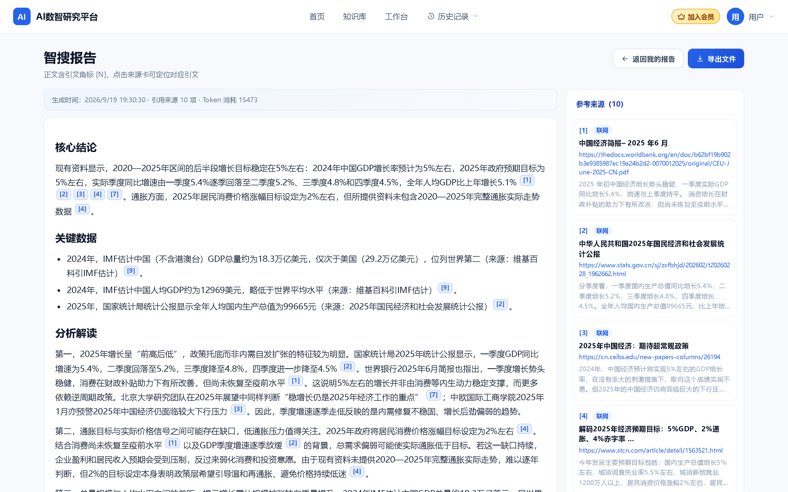
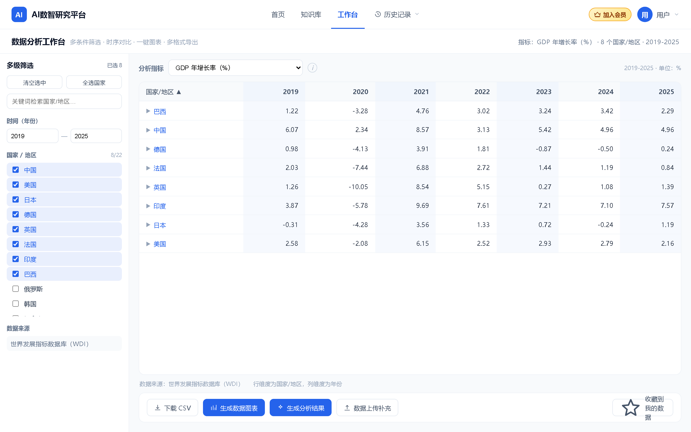
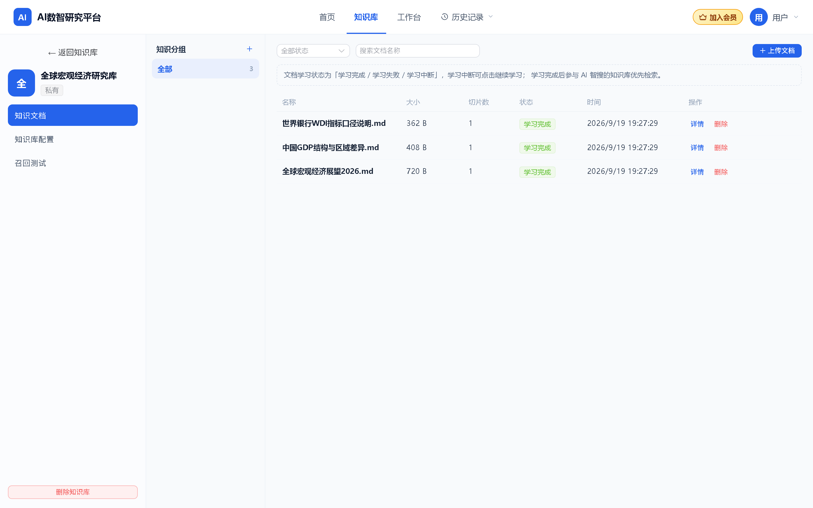
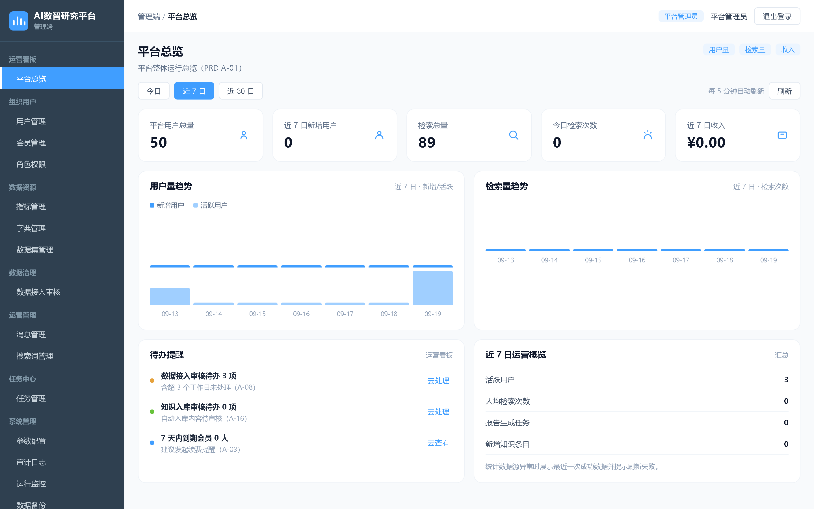
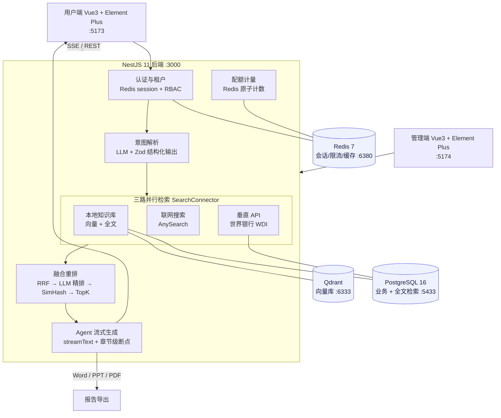

<div align="center">


# AI 数智研究平台

**一站式数据智能搜索 · 知识库 RAG · 数据分析工作台 · AI 研究报告生成**

面向产业研究与决策支持的多租户 SaaS 平台。输入一个研究问题，AI 自动完成
多源检索、数据标准化、智能分析与成果生成，全程流式可视、引文可溯源。

[English](./README.en.md) · [快速开始](#-快速开始) · [架构设计](#-架构设计) · [文档集](#-文档索引)


</div>

---

## 📌 这是什么

研究者做一次产业分析，通常要在搜索引擎、统计局数据库、Excel、向量库和文档编辑器之间反复横跳。
本平台把这条链路收拢成一次提问：

```
用户提问 → 意图解析（结构化条件回填）→ 三路并行检索 → RRF 融合 + LLM 精排
        → Agent 流式生成报告 → 引文角标 ↔ 来源卡联动 → 导出 Word / PPT / PDF
```

核心设计哲学是 **Pipeline-First**：数据获取、清洗、融合是**确定性工程**（可单测、质量可控），
Agent 只做综合推理，不做数据脏活。这是平台的竞争力所在，也是全部技术选型的主轴。

## 🖼️ 产品实拍

> 以下截图均为本地真实环境运行产出（非设计稿），数据来自世界银行 WDI 与联网检索。

| AI 智搜 · 流式报告与来源联动 | 数据分析工作台 · 时序宽表 |
| :--: | :--: |
| 报告正文引文角标 `[1] [2] [4]` 与右侧来源卡一一对应，头部展示引用来源数与 Token 消耗 | 国家/地区 × 年份矩阵，多级筛选实时计数，支持上传补充与一键生成分析结果 |
|  |  |

| 知识库 · 三栏管理 | 管理端 · 运营看板 |
| :--: | :--: |
| 库 → 分组 → 文档三层结构，文档学习状态机，配置与召回测试同页可达 | 用户量 / 检索量 / 收入趋势聚合，待办提醒与运营概览 |
|  |  |

## ✨ 核心能力

### 🔍 AI 智搜（平台核心竞争力）

- **意图解析回填**：LLM 按 Zod schema 输出 `{intent, countries[], indicators[], yearFrom, yearTo, routeHints}`，
  经 SSE `cond_fill` 事件回填前端条件栏，用户手动指定的条件优先级更高
- **三路并行检索**：本地知识库 / 联网搜索 / 垂直 API（世界银行 WDI）统一 `SearchConnector` 接口，
  `Promise.all` 并行 + 单路超时熔断（联网 15s / 垂直 10s / 本地 3s），一路失败不阻塞整体
- **知识库优先短路**：混合模式下先跑本地库，命中足够则不发联网请求，并通过 `search_route` 事件告知前端实际走了哪些路
- **融合与精排**：RRF（k=60，本地命中加权 ×1.2）→ LLM listwise 精排（关闭思考模式，8s 超时自动回退 RRF）→ SimHash 去重 → 相似度截断 → TopK
- **五阶段流式可视化**：`intent → searching → fusing → generating → done`，阶段事件先行，首字节 ≤ 3s
- **两段式交互**：先出来源清单供用户勾选，再按勾选集合生成报告（角标连续重编号，不重复计费）
- **断点续跑**：检索快照 30 分钟有效，章节级断点落库，中断后「继续生成」不重跑已成功章节、不重复扣费

### 📚 知识库 RAG

四层数据模型（库 → 分组 → 文档 → 切片），支持 Excel / CSV / Word / PDF / Markdown 解析。
BullMQ 异步切片与向量化，文档状态机（学习中断 → 学习完成 / 学习失败，可继续或重新学习）。
库级可配分段方式、分段长度、重叠、向量模型、TopK、相似度阈值与混合检索权重。
内置召回测试面板，命中片段按相似度分级并可回看原文。智搜报告与工作台分析结果均可「存入知识库」。

### 📊 数据分析工作台

国家/地区、时间、指标序列、数据来源四维筛选，实时计数；时序宽表（行 = 经济体，列 = 年份），
无数据以 `..` 占位，行可展开元数据。Excel/CSV 上传即时并入筛选项与表格。
ECharts 折线/柱状/面积/雷达图，数据标签开关与时间区间滑块，PNG/SVG 导出。

### 📄 报告生成与导出

固定章节结构流式生成（核心结论 / 关键数据 / 分析解读 …），正文 `{c:N}` 引文标记映射文末来源表。
导出 Word（docx）、PPT（pptxgenjs）、PDF（pdfkit），报告版本化留存生成参数快照。

### 💳 会员计费与多租户

免费体验 / 专业版（¥59 单月、¥49 连续包月、¥499 年付）/ 企业版（¥399 / ¥329 / ¥3999）。
订单状态机 + 支付回调幂等（订单号唯一约束 + 状态前置校验），Redis 原子计数配额拦截，
渠道适配器抽象（含 MOCK 渠道，HMAC-SHA256 验签 + 5 分钟防重放）。
Redis session 分布式登录态，支持踢下线与在线设备管理；RBAC 三角色 + `tenant_id` 强制注入。

### 🛠️ 管理端（9 模块 20 功能）

运营看板、组织用户、数据资源（指标/字典/数据集）、数据治理（导入审核）、运营管理（公告/搜索词）、
任务中心（BullMQ 队列面板）、系统管理（参数热更新/审计/监控/备份）、知识库管理、支付中心。

### 📈 可观测与安全

Pino 结构化日志 + Prometheus 指标 + OpenTelemetry 链路 + Sentry 异常，四位一体；
令牌桶限流 + SSE 并发槽位；提示词注入 L1 归一化 + L3 规则分级拦截；敏感词前置拦截并落审计；
环境变量 Zod 启动校验 fail-fast；`pg_dump` 备份与恢复演练脚本。

## 🏗️ 架构设计



**分层要点**

| 关注点 | 做法 |
| --- | --- |
| 类型一致性 | `packages/shared` 以 Zod schema 为单一事实源，前后端共用 DTO 类型，编译期消灭接口不一致 |
| 多租户隔离 | Prisma Client Extension 强制注入 `tenant_id`，跨租户访问统一视为「不存在」 |
| 流式协议 | SSE 单通道承载 9 类事件（`stage` / `cond_fill` / `search_route` / `source` / `sources_ready` / `section_done` / `report_chunk` / `done` / `error`），带心跳保活 |
| 降级策略 | 无外部 Key 时自动退化（向量检索 → 纯全文；精排 → RRF 截断；BullMQ 不可用 → 同步学习），本地零依赖可跑通 |
| 统一响应 | `{code, message, data}`，错误码分段：1xxx 认证 / 2xxx 权限租户 / 3xxx 参数 / 4xxx 业务 / 5xxx 系统 |

## 🧱 技术栈

| 层 | 选型 |
| --- | --- |
| 运行时 / 语言 | Node.js 22 LTS · TypeScript 5.7 · pnpm 9 monorepo |
| 后端 | NestJS 11 · Prisma 7 · Zod · BullMQ · Vercel AI SDK 7 |
| 数据 | PostgreSQL 16（业务 + 中文全文检索 + trgm 索引）· Qdrant 1.15 · Redis 7 |
| 前端 | Vue 3.5 · Element Plus 2.9 · Pinia · Vue Router · Vite 6 · ECharts 6 |
| 模型 | 火山方舟 DeepSeek-V4-Pro-GA（主力）· 豆包 Seed（备选）· doubao-embedding · OpenAI 兼容协议可配置切换 |
| 文档处理 | exceljs · csv-parse · mammoth · pdf-parse · docx · pptxgenjs · pdfkit |
| 可观测 | Pino · Prometheus + Grafana · OpenTelemetry + Jaeger · Sentry |
| 基础设施 | Docker Compose（本地）· GitHub Actions（lint → test → build） |

## 📁 项目结构

```
.
├── backend/                    # NestJS 11 API + Worker
│   ├── prisma/                 #   schema（40 model / 19 enum）+ 18 条迁移 + 管理员种子
│   ├── scripts/                #   SSE / 工作台压测、安全审计、备份恢复演练
│   └── src/
│       ├── common/             #   拦截器、异常过滤、守卫、限流、SSE、可观测、Prisma
│       └── modules/
│           ├── search/         #   ★ 智搜编排：intent / connectors / fusion / generate / sse / task
│           ├── kb/             #   知识库 RAG：parse / chunk / embeddings / vector / learning / retriever
│           ├── workspace/      #   数据工作台
│           ├── report/         #   报告导出（Word / PPT / PDF）
│           ├── member/         #   会员、订单、支付渠道
│           ├── admin/          #   管理端 9 模块
│           └── auth/           #   认证与会话
├── frontend/
│   ├── web/                    # 用户端 SPA（12 视图）
│   └── admin/                  # 管理端 SPA（22 视图）
├── packages/shared/            # 前后端共享 DTO / 错误码 / 响应体
├── infra/                      # Prometheus 抓取与告警规则、Grafana 面板
├── docs/                       # 19 篇方案与技术方案文档
└── docker-compose.yml          # PG + Qdrant + Redis + Jaeger/Prometheus/Grafana
```

## 🚀 快速开始

**前置要求**：Node.js ≥ 22、pnpm 9、Docker Desktop

```bash
# 1. 安装依赖
pnpm install

# 2. 起本地基础设施（PG 5433 / Qdrant 6333 / Redis 6380）
docker compose up -d postgres qdrant redis

# 3. 配置环境变量（按需填方舟 Key / AnySearch Key，留空则自动降级）
cp .env.example backend/.env

# 4. 生成 Prisma Client 并应用迁移
pnpm --filter @app/api exec prisma generate
pnpm --filter @app/api exec prisma migrate deploy

# 5. 种子管理员 + 启动三端
pnpm seed:admin
pnpm dev
```

| 服务 | 地址 | 说明 |
| --- | --- | --- |
| 用户端 | http://localhost:5173 | 智搜即首页 |
| 管理端 | http://localhost:5174 | 账号 `admin`，初始密码见 `prisma/seed-admin.ts` |
| API | http://localhost:3000/api/v1 | 健康检查 `GET /health?verbose=true` |
| Grafana | http://localhost:3300 | `docker compose up -d` 起观测栈后可用 |
| Jaeger | http://localhost:16686 | 链路追踪 |

> **零外部依赖可跑通**：未配置 `ARK_API_KEY` 时意图分类与生成走降级路径、向量检索退化为纯全文检索；
> 未配置 `ANYSEARCH_API_KEY` 时联网路走匿名模式。首次联调可用 `POST /api/v1/auth/dev-login`
> 免验证码登录（需 `DEV_LOGIN_ENABLED=true`，**生产必须关闭**）。

**常用命令**

```bash
pnpm test                  # 后端单元测试（686 例）
pnpm --filter @app/api test:integration   # 关键链路集成测试（需 PG + Redis）
pnpm lint                  # ESLint 9
pnpm build                 # shared → api → web → admin 依序构建
pnpm --filter @app/api bench:sse          # SSE 并发压测
pnpm --filter @app/api bench:audit        # 安全渗透自测
pnpm --filter @app/api backup:drill       # 备份恢复演练
```

## ✅ 质量指标

**工程实测值**（本仓库当前状态）

| 指标 | 数值 |
| --- | --- |
| 单元测试 | **686 例全绿**（69 个测试文件，`vitest run` 约 7.6s） |
| 接口规模 | 140 个路由处理器 · 40 个 Prisma 模型 · 18 条迁移 |
| 代码规模 | 约 40,400 行 TypeScript / Vue（不含生成代码） |
| 前端视图 | 用户端 12 个 · 管理端 22 个 |
| 安全自测 | 渗透自测 16 项通过（`bench:audit`） |
| 备份演练 | `pg_dump` 真实落盘 + 恢复后行数一致（`backup:drill`） |

**性能设计目标**（见 [03-方案设计](docs/03-方案设计.md) 非功能需求）

| 指标 | 目标 |
| --- | --- |
| 智搜首字节延迟 | ≤ 3s（阶段事件先行，正文流式跟进） |
| 智搜全链路 P95 | ≤ 30s（含生成） |
| 工作台查询 P95 | ≤ 500ms |
| SSE 并发 | 单实例 1k 连接（压测脚本验证） |
| 可用性 | 99.9%（生产） |

CI 在每次 push / PR 到 `main` 时执行 `install → prisma generate → lint → test → build`。

## 🗺️ 里程碑

```
M0 工程地基 → M1 认证与多租户 → M2 智搜核心管道 ★ → M3 知识库 RAG
                                                      ↓
                M7 上线强化 ← M6 管理端 ← M5 会员计费支付 ← M4 工作台与报告
```

| 里程碑 | 状态 | 内容 |
| --- | :--: | --- |
| M0 工程地基 | ✅ | monorepo、docker-compose、NestJS 骨架、双端脚手架、CI |
| M1 认证与多租户 | ✅ | Redis session、手机验证码 + 账密、RBAC、租户中间件 |
| M2 智搜核心管道 | ✅ | 意图解析、三路检索、RRF 融合、流式生成、引文联动 |
| M3 知识库 RAG | ✅ | 四层模型、上传解析、切片向量化、混合检索、召回测试、入库闭环 |
| M4 工作台与报告 | ✅ | 时序宽表、图表视图、分析结果页、Word/PPT 导出、我的数据/报告 |
| M5 会员计费支付 | ✅ | 套餐体系、订单状态机、回调幂等、配额拦截、会员中心三页 |
| M6 管理端 | ✅ | 9 模块 20 功能、22 视图全部真实落地 |
| M7 上线强化 | 🔨 | 可观测四件套、压测限流、安全加固、备份演练已完成；生产化部署进行中 |
| 智搜增强 | ✅ | PDF 导出、知识库优先短路、补充上传本地资料、任务管控与断点续跑、失败章节重生成 |

## 📚 文档索引

| 文档 | 主题 |
| --- | --- |
| [01-技术选型](docs/01-技术选型.md) | 选型背景、总体技术栈、关键技术决策记录 |
| [02-架构设计](docs/02-架构设计.md) | 分层架构、模块划分、数据流 |
| [03-方案设计](docs/03-方案设计.md) | 功能总览、模块方案、接口设计规范、非功能需求 |
| [04-开发规划](docs/04-开发规划.md) | 里程碑计划与逐阶段进度记录 |
| [05](docs/05-M2技术方案.md) · [06](docs/06-M2.2技术方案.md) | M2 智搜基础管道 / 两路取数 |
| [07-M3技术方案](docs/07-M3技术方案.md) | 知识库 RAG 四层模型、学习队列、混合检索 |
| [08](docs/08-M4技术方案.md) · [09](docs/09-M4.2技术方案.md) · [10](docs/10-M4.3技术方案.md) · [11](docs/11-M4.4技术方案.md) | M4 工作台、图表、分析结果页、导出 |
| [12-M5技术方案](docs/12-M5技术方案.md) | 会员套餐、订单状态机、支付与配额 |
| [13-M6技术方案](docs/13-M6技术方案.md) | 管理端 9 模块 20 功能 |
| [14-M7技术方案](docs/14-M7技术方案.md) | 可观测、压测限流、安全加固、备份演练 |
| [15-质量保障优化](docs/15-质量保障优化.md) | 质量项清单与实施记录 |
| [16-智搜提示词注入防护](docs/16-智搜提示词注入防护.md) | 注入防护分层设计 |
| [17-智搜交互重构](docs/17-智搜交互重构需求.md) · [技术方案](docs/17-智搜交互重构技术方案.md) | 两段式交互需求与落地方案 |
| [17-真实渠道接入安全清单](docs/17-真实渠道接入安全清单.md) | 支付/短信真实渠道接入前检查项 |
| [18-智搜增强需求](docs/18-智搜增强需求.md) | 四项增强需求与验收标准 |
| [19-智搜增强技术方案](docs/19-智搜增强技术方案.md) | 增强的落地技术方案 |

## 🤝 贡献

欢迎提 Issue 与 PR。开发前请先阅读 [01-技术选型](docs/01-技术选型.md) 与 [03-方案设计](docs/03-方案设计.md)
了解设计约束；提交信息遵循 [Conventional Commits](https://www.conventionalcommits.org/zh-hans/)（`feat:` / `fix:` / `refactor:` / `docs:` / `chore:`）。

## 📄 许可证

本项目暂未附加开源许可证，版权归作者所有。如需商用或开源授权，请先与维护者联系。

---

<div align="center">

如果这个项目对你有参考价值，欢迎点个 **Star** ⭐ 支持

</div>
